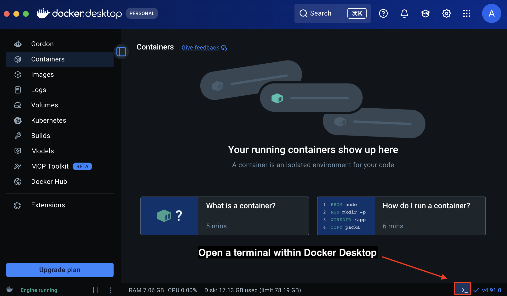
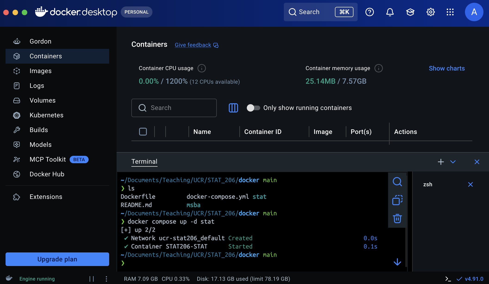
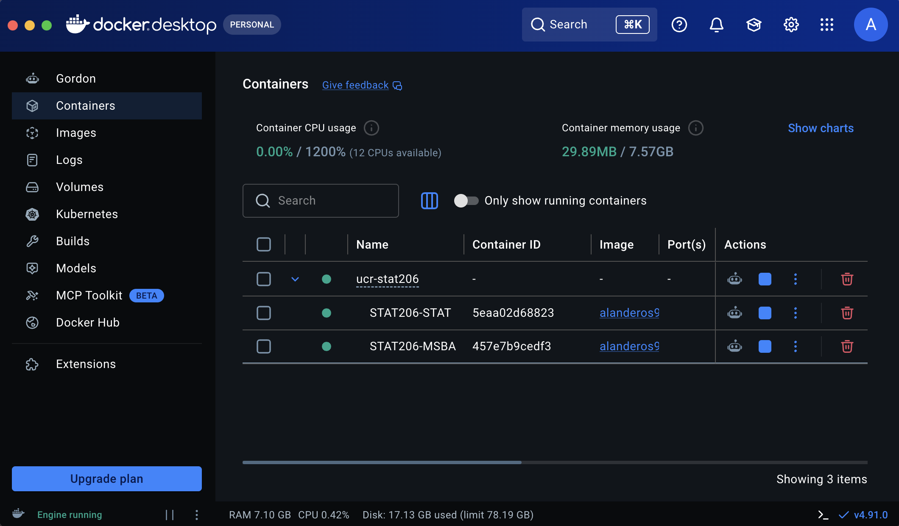
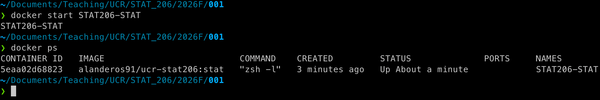

## Goals

By completing this guide, you will

1. have access to Docker Desktop on your computer,
2. understand how to use the class Docker image (or Dockerfile) to create a container with persistent storage, and
3. have access to a standardized computing environment.

## What is Docker?

Docker is a collection of technologies that allow developers to run applications in isolated environments.
For example, a company like Netflix might use multiple containers to isolate different parts of the user experience (logging in to your account, billing, selecting a series to binge).
In the realm of data analysis, researchers and analysts use Docker to package fragile software stacks, such as a specific version of Julia, Python, or R combined with custom libraries and GPU drivers, so that data processing, modeling, and other pipelines can be shared and run anywhere without breaking.
In either setting, careful management of the **computing environments** under which discrete tasks are carried out is a central concern.

## Why are we using Docker?

While there are many ways in which containers might be applied, our interest in isolated environments is motivated by the following:

1. **Standarization and Consistency**. Everyone in the class will run the same OS, the same system dependencies, and identical software versions.

2. **Minimal Installation Friction**. There *is* a benefit to learning how to manage systems on your own, from scratch, as you build out your workspace and tools. Unfortunately, the quarter system does not allow much time for exploration, experimentation, and failure. *Most of the hard work has been handled by building the class Docker image*.

3. **Reproducbility**. Containerization helps us practice reproducbility in our work. It makes for good science, good software, and excellent communication of your work.

## So how do I use it?

There are few terms we need to define before we use Docker.

- **Dockerfile**: This is a recipe that defines an environment. It's just a text file with Bash commands (usually) and some additional Docker-specific syntax.
- **Image**: This is the product generated by running the recipe in a Dockerfile. It is a **read-only environment**, configured with a specific Operating System (OS), file structure, and accompanying software.
- **Container**: Whereas images are static, containers are dynamic. It is the "runtime" or how we use a Docker image. A single image can be used to spin up multiple containers, each running instances of the same or related applications. The environment is the same each time you create a container, from scratch, using the same image.
- **Volume**: You can create and destroy data within a container, but Docker containers are deliberately disposable. A (storage) volume allows you to persist data after you shut down a container. This works by mapping data (files, folders, programs, etc) from a container to your *disk*.
- **Docker Desktop**: The main software from Docker that we will use, which handles building images, container creation, and deployment.

### 1. Download and Install Docker Desktop

Point your preferred web browser to [https://www.docker.com/products/docker-desktop/](https://www.docker.com/products/docker-desktop/) and select the appropriate download for your OS and architecture.

:::::::::::::::::::::::::::::: callout-warning

### Windows Users

- If you have a Surface or Copilot+ laptop, it has a Qualcomm Snapdragon CPU. **Select the ARM64 option.**
- Otherwise, you have an Intel or AMD CPU. **Select the AMD64 option**.

::::::::::::::::::::::::::::::

Follow instructions from the installer.

### 2. Download our `docker-compose.yml`

- This is a file to automatically construct a container from pre-built images.
- Please download it from Canvas.
- Be sure to download it to a convenient location where you would like to store your course materials.

:::::::::::::::::::::::::::::: callout-warning

### Windows Users

Avoid placing your course materials, including `docker-compose.yml`, inside a folder that is backed up by cloud services like OneDrive or Google Drive.
The automated nature of such tools risk corrupting your files if a backup triggers while your container is running, resulting in data loss.

**Suggested Workaround**: Store your work directly under your `C:\` drive; for example `C:\STAT206`.

::::::::::::::::::::::::::::::

### 3. Create your local container

First, open the terminal view in Docker Desktop.

{fig-align="center" width=70% fig-alt="Screenshot of Docker Desktop illustrating how to open a terminal."}

Next, navigate to the folder/directory containing the `docker-compose.yml` file.
Once you've verified the file's presence, enter and run the command `docker compose up -d stat`.

{fig-align="center" width=70% fig-alt="Screenshot of Docker Desktop terminal creating a container with Docker Compose."}

The *Containers* tab in Docker Desktop shows the status of your container.

{fig-align="center" width=70% fig-alt="Screenshot of Docker Desktop showing container status after creating a container."}

- Gray circle: Not running
- Green circle: Running (in the background)
- You can start/stop the container using the Play/Stop button under *Actions*.

The `docker ps` command can also be used to monitor your container from a CLI.

{fig-align="center" width=70% fig-alt="Screenshot of a generic terminal illustrating the docker start and docker ps commands."}


### 4. Using the Container

If you want to access the container from your machine's Terminal:

```text
docker start -ai STAT206-STAT
```

- `docker start`: The `start` action will only start an existing container.
- `-ai`: The option `a` ensures we can see messages in our terminal and propagates signals (such as force quitting). The option `i` is used to indicate an interactive session.
- `STAT206-STAT` the name of the container we wish to run.

If you just want the container to run in the background so you can connect to it using VSCode:

```text
docker start STAT206-STAT
```

You can stop a running container using:

```text
docker stop STAT206-STAT
```