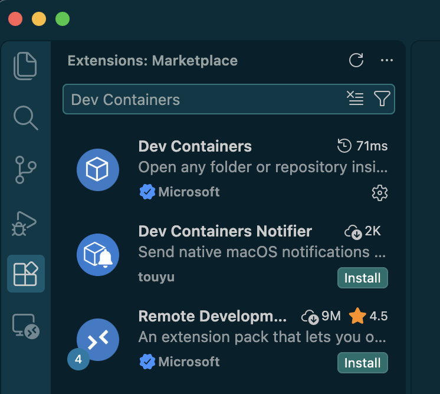
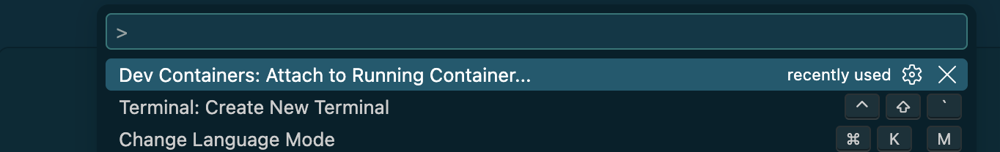
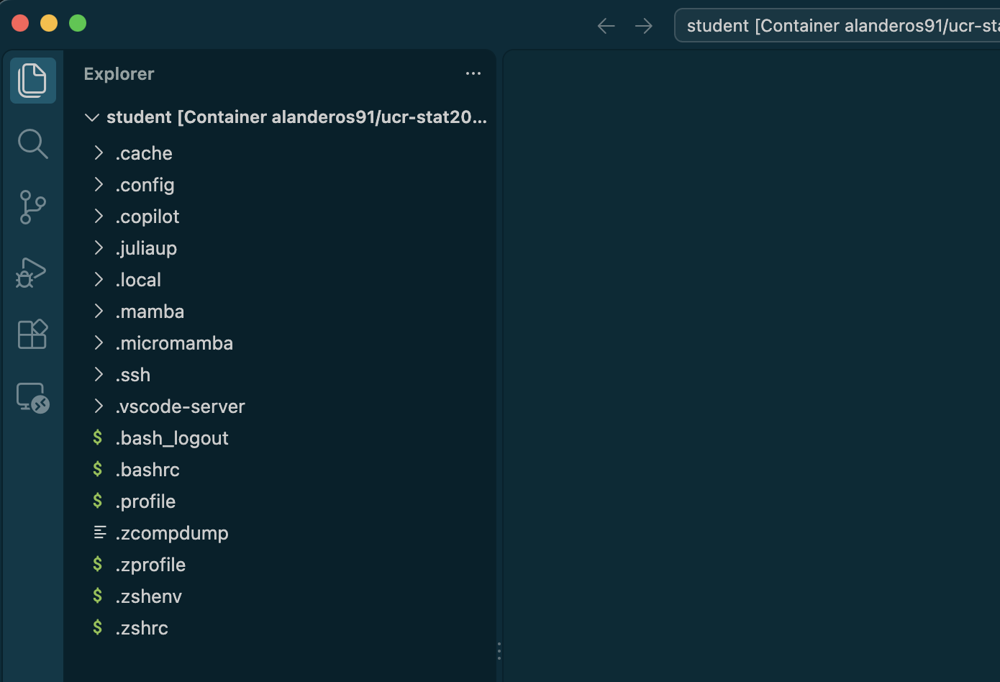
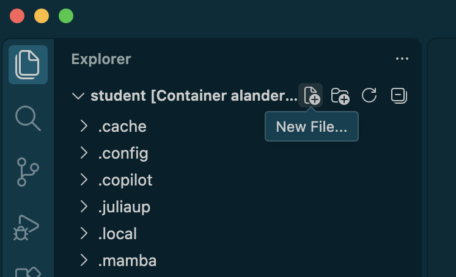
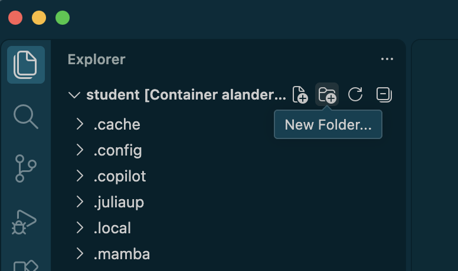
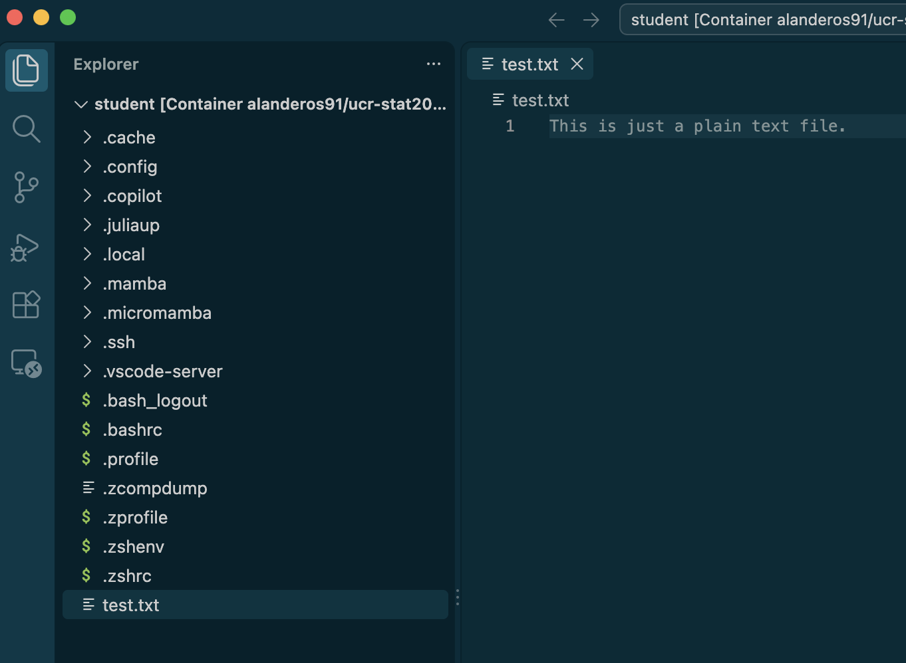
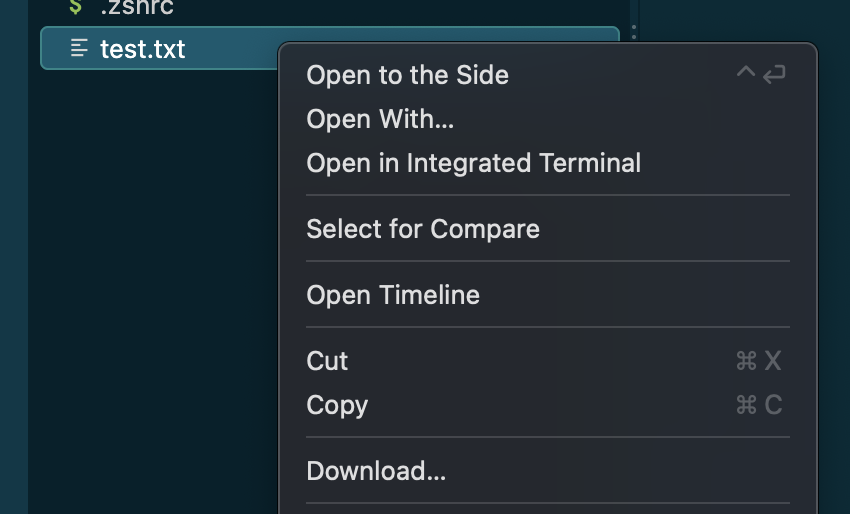

## Goals

This guide assumes you have installed VSCode, Docker Desktop, and are able to start a container using the class image.

By completing this guide, you will

1. be able to connect VSCode to your local container,
2. understand how to view, edit, and organize files and directories inside `/home/student` through VSCode,
3. access a Linux shell within VSCode, and
4. download and upload files to and from a container, respectively.

## Basic Setup

### 1. Install the Dev Containers Extension

In VSCode, navigate to the Extensions menu and install the [Dev Containers](https://marketplace.visualstudio.com/items?itemName=ms-vscode-remote.remote-containers) extension.

{fig-align="center" width=70%}

### 2. Make sure a container based on the class image is running.

- **From a terminal**, run `docker start STAT206-STAT`.
- **From Docker Desktop**, open the dashboard and navigate to Containers. Click on the Run button for STAT206-STAT.

### 3. Attach a VSCode window to the container

Open the *Command Palette* and select `Dev Containers: Attach to Running Containers...` and wait for the connection.

{fig-align="center" width=70%}

- Windows: <kbd>Ctrl</kbd> + <kbd>Shift</kbd> + <kbd>P</kbd>
- MacOS: <kbd>Ctrl</kbd> + <kbd>Shift</kbd> + <kbd>P</kbd>

Now VSCode can interact with the file system on the container.
In the future, you only need to attach VSCode to the container.

## Manipulating files through VSCode

The File Explorer allows you to explore directories and view files.

{fig-align="center" width=70%}

- Windows: <kbd>Ctrl</kbd> + <kbd>Shift</kbd> + <kbd>E</kbd>
- Linux/MacOS: <kbd>Ctrl</kbd> + <kbd>Shift</kbd> + <kbd>E</kbd>

There are *New File* and *New Folder* buttons that appears in the top right-hand corner of the File Explorer when hovering your cursor.

{fig-align="center" width=70%}

{fig-align="center" width=70%}

Opening a file allows you to edit its contents like any other text editor. The Extensions feature in VSCode can modify the editor to provide additional support for specific file types.

{fig-align="center" width=70%}

## Accessing a terminal within VSCode

Open the command palette and select `Terminal: Create New Terminal`.

## Moving files between your machine and the container

To **download** a file or directory *from* the container, right-click it and choose the *Download...* option.

To **upload** a file or directory *to* the container, you can drag and drop it onto the File Explorer.

## Installing extensions

Any VSCode extensions you like must be installed on the container side. Recommended extensions for this class:

1. [Julia](https://marketplace.visualstudio.com/items?itemName=julialang.language-julia)
2. [Quarto](https://marketplace.visualstudio.com/items?itemName=quarto.quarto)
