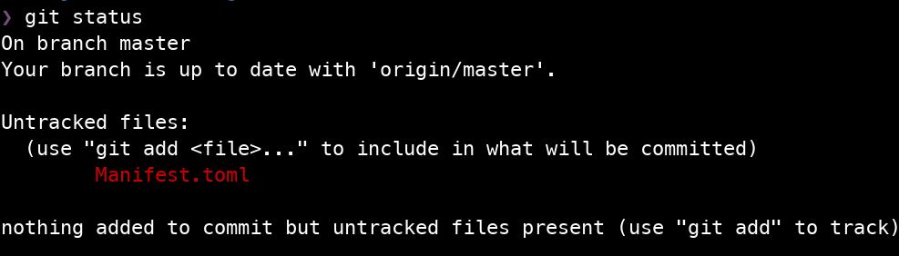
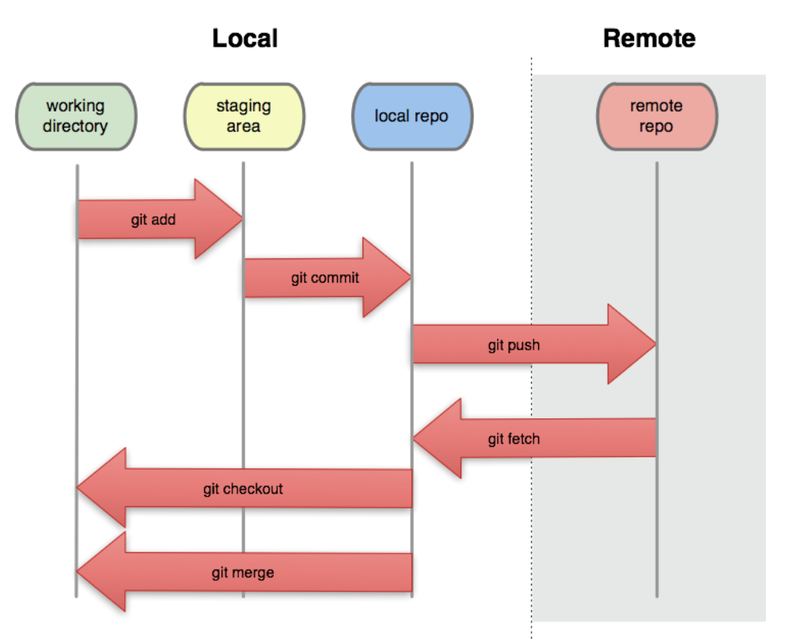

## Additional Materials

-  Blischak JD, Davenport ER, Wilson G (2016) A Quick Introduction to Version Control with Git and GitHub. PLoS Comput Biol 12(1): e1004668. doi: [10.1371/journal.pcbi.1004668](https://doi.org/10.1371/journal.pcbi.1004668)

## Goals

1. Develop an understanding and appreciation of Git and version control.
2. Understand the difference between a local and remote repository.
3. Become familiar with basic Git commands and a basic single user workflow.

## What is Version Control?

> An article about computational science in a scientific publication is not the scholarship itself, it is merely the advertising of the scholarship. The actual scholarship is the complete software development environment and the complete set of instructions which generated the figures.

--- [Buckheit and Donoho (1995)](https://link.springer.com/chapter/10.1007/978-1-4612-2544-7_5), summarizing Jon Claerbout's ideas on reproducible research in computational sciences.

Researchers (Data Scientists, and other professionals) often need to manage a number of documents:

- manuscripts/technical reports
- notes
- data
- images
- code
- scripts

Today, many of those documents live on a computer.

- Tracking different *versions* of a document by hand is tedious and error-prone.
- Tracking the *history* of a changing document is cumbersome.

**Version control** has its origins in software development and has increasingly been adopted across various disciplines, including data science.

## What is Git?

- A [tool](https://git-scm.com/) for *distributed* version control.
- Originally developed by [Linus Torvaldis](https://en.wikipedia.org/wiki/Linus_Torvalds) for managing the Linux kernel.
- Multiple people own and can edit copies of a repository.
- Git operates on changes between versions of a document, effectively tracking line-by-line changes.
- Each version of the repository exists as a commit, or snapshot.

## The model

Git keeps track of versions for various files, along with a log that tells us about why things changed.

{fig-align="center" width=50%}

- **working directory**: the directory on your machine that represents your repository of files under version control.
  - These are just the files and directories that make up a project. There is no history or version control history.
- **staging area**: files that you tag to commit changes are said to be staged / in the staging area.
- **local repo**: your local repository; the collection of all the files in your folder + changes + history.
  - This consists only of your commits. Any changes/edits to files *not committed* are *not* in the local repository.
  - Your commits are linked to each other. This lets us go back in time to a different state of the working directory.
- **remote repo**: a foreign version that lives elsewhere; usually a backup on GitHub, GitLab, or Bitbucket.
- **commit**: a snapshot of the project. This consists of specific files that were added/removed/edited + an informative message by the *commit author*.

The main idea is that `git` helps you put your projects under version control by examining *your working tree*, comparing to the *local repo*, and informing you of changes that have occurred.
It is then incumbent on YOU to manage those changes and move them onto the staging area to be organized into commits stored in the local repo.

:::::::::::::::::::::::::::::::: callout-note
## Branches in Git

Git allows you to maintain multiple versions of the same workspace with separate commits using **branches**.
By default, Git initializes your local repository with a `main` or `master` branch.

We will revisit branching much later in the course when we start using Git to collaborate with others.

::::::::::::::::::::::::::::::::

## Basic commands

The list below is by no means exhaustive.

### `git init`

This **initializes** a working directory as a *local Git repository*. Specifically, it creates a `.git` directory to store the history and metadata about various files in the repository.

### `git add <name of a file or directory>`

Adds files to the *staging area* so that you can create a commit.

### `git commit`

Opens an editor to draft a message associated with your proposed *commit*. This command supports various additional options.

- **Add the message in-line**: `git commit -m "This is my commit message"`
- **Edit the previous commit**: `git commit --amend`
- **Edit the previous commit, without updating the message**: `git commit --amend --no-edit`

### `git status`

Check that state of the repository. This will highlight any files that have been edited, any that are not tracked, and any that might already be staged.

### `git log`

Explore the local repository's history.

### `git diff`

Compare differences across commits.

### `git push`

Upload the work on your local repository to a remote repository.

### `git fetch` / `git pull`

Download the work on a remote repository to your local repository.

## Writing a commit message

> The next person to read your work in 6 months is not going to be some schmuck. It's going to be YOU!

--- A certain UCR Statistics Professor

Treat commit messages like entries in a journal. They are meant to be read by someone.
There are two parts of a commit message:

1. The first line: A succinct summary. This is what gets displayed in most Git tools; e.g. on GitHub.
2. The rest: Add additional lines to add more context. A commit message can be as long as you want. Use it!

## A basic single user workflow

### Using Git for the first time on a new computer

1. Set up your identity in Git. See [Lab 0 on how to configure Git](../../labs/lab0-setup.qmd#configure-git).
2. Consider setting up a global `.gitignore`.
3. Set up SSH access to your GitHub/GitLab/Other Git Service for the new machine.

### Setting up a new project

1. Create the main project directory and `cd` into it.
2. Run `git init`.
3. Set up the project with some basic files so you can create an initial commit. For example, adding a `README.md` is a good first step especially if you plan to host the project on GitHub.
4. Set up a remote repository, if applicable.
5. Run `git add ...` and `git commit ...` to create the first commit in the project.
6. Push the initial commit to the remote repository.

### Working on a project

0. Run `git status` to check for local changes. Run `git fetch --all` to check for remote changes.
    + If your remote repo has changes, consider whether you can `git pull` them.
1. Edit some file(s), working towards The Next Logical Step.
    + This should be implementing some small part of your project. For example, writing a specific function that your project requires can be The Next Logical Step.
    + At The Next Logical Step, the project should be in a semi-working state.
    + In the early phase of a project, that might mean that you've worked out enough to test basic functionality.
    + For example, you might write a script or function to load a dataset and print some summary statistics.
2. Run `git add ...` to organize files and changes associated with The Next Logical Step.
3. Write an informative message about what was done and any useful context.
