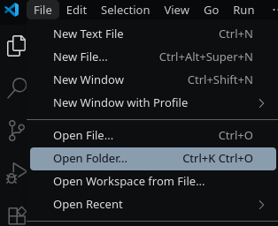
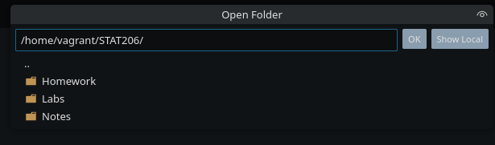
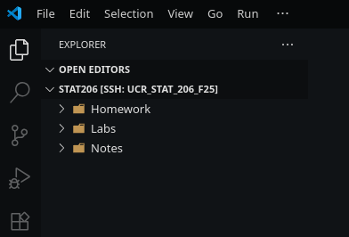
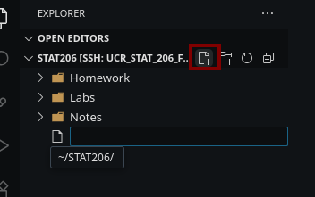
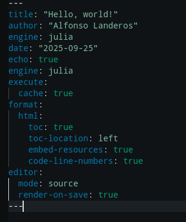

## Additional Materials

- [(Tutorial) Hello, Quarto](https://quarto.org/docs/get-started/hello/vscode.html)
- [(Tutorial) Computations](https://quarto.org/docs/get-started/computations/vscode.html)
- [(Tutorial) Authoring](https://quarto.org/docs/get-started/authoring/vscode.html)
- [(Book) Quarto: The Practical Guide](https://quarto-tdg.org/)


## Goals

1. Understand literate programming as a tool for communicating results from computational projects.
2. Become familiar with the front matter/header in a Quarto document.
3. Practice using Quarto.


## Literate Programming

> I believe that the time is ripe for significantly better documentation of programs, and that we can best achieve this by considering programs to be works of literature. Hence, my title: "Literate Programming."
>
> Let us change our traditional attitude to the construction of programs: Instead of imagining that our main task is to instruct a computer what to do, let us concentrate rather on explaining to human beings what we want a computer to do.
>
> The practitioner of literate programming can be regarded as an essayist, whose main concern is with exposition and excellence of style. Such an author, with thesaurus in hand, chooses the names of variables carefully and explains what each variable means. He or she strives for a program that is comprehensible because its concepts have been introduced in an order that is best for human understanding, using a mixture of formal and informal methods that reinforce each other.

--- [Donald Knuth. "Literate Programming (1984)" in Literate Programming. CSLI, 1992, pg. 99.](http://www.literateprogramming.com/)


## Your First Quarto Document

This assumes you are connected to the VM over VSCode. You are encouraged to render your document throughout each step using `> Quarto: Preview` from the Command Palette.


### Open the STAT 206 Folder

Navigate to `File` \> `Open Folder`. This will show directories *on the guest machine*.



A window will pop up for you to select your folder. Choose `STAT206`. You will use this to store your work.



The File Browser on the left hand side will now show the folder contents.




### Create a new file

Name the file `Test.qmd`. Quarto files use the `.qmd` file extension.




### Add the front matter

The 'front matter' is the header located at the top of every Quarto document, beginning and ending with exactly three dashes, `---`. It specifies various metadata about your document as well as how it should be rendered. Parameters are given as key-value pairs delimited by colons `:`; that is, `parameter-name: parameter-value`. Some parameters are nested, and so it is crucial that you mind the whitespace used.



-   `title`, `author`, `date`: self-explanatory
-   `engine`: It specifies the engine used to render your document. We will always use `julia` for this class.
-   `execute`: Various execution options. We recommend using `cache: true` to avoid running code whenever you only edit text.
-   `format`: Various format options. You can specify settings for other document types (e.g. PDF), but we will use HTML for this class.
    -   Always make sure `embed-resources: true` is set! This makes it easy to share your reports as a single self-contained document.
-   `editor`: Various editor preferences. I prefer to write in `source` mode, but a `visual` editor is also available.
    -   `render-on-save: true` is useful if you like refreshing your preview every time you save your work.


### Add some headings

Copy and paste the following [Markdown](https://www.markdownguide.org/cheat-sheet/) into the body of your document.

```         
# Welcome!

## Level 2

### Level 3
```


### Add a Julia code cell

Code cells are delimited with triple backticks, \`\`\`. Use `{julia}` to specify the Julia language for a code cell.

Add the following Julia code in a cell anywhere in your document: `bitstring(206)`.


### Preview/Render your work

Open the Command Palette (<kbd>Ctrl</kbd> + <kbd>Shift</kbd> + <kbd>P</kbd>) and select `Quarto: Preview` or `Quarto: Render`. This will create the HTML report of your document. Notice that the preview opens on your browser, on the host machine.