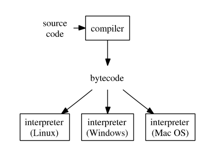
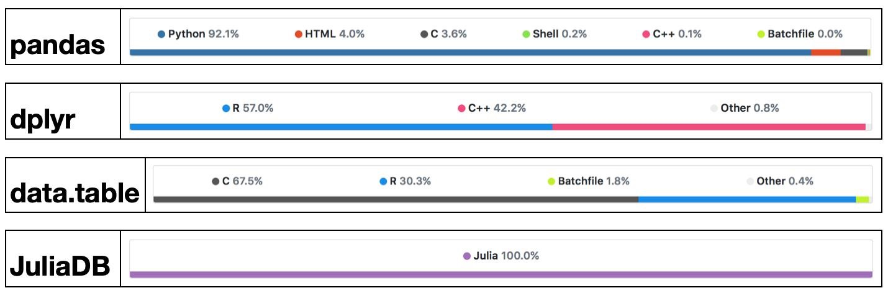
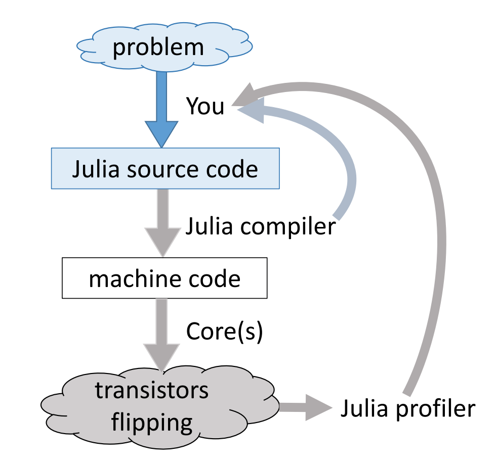
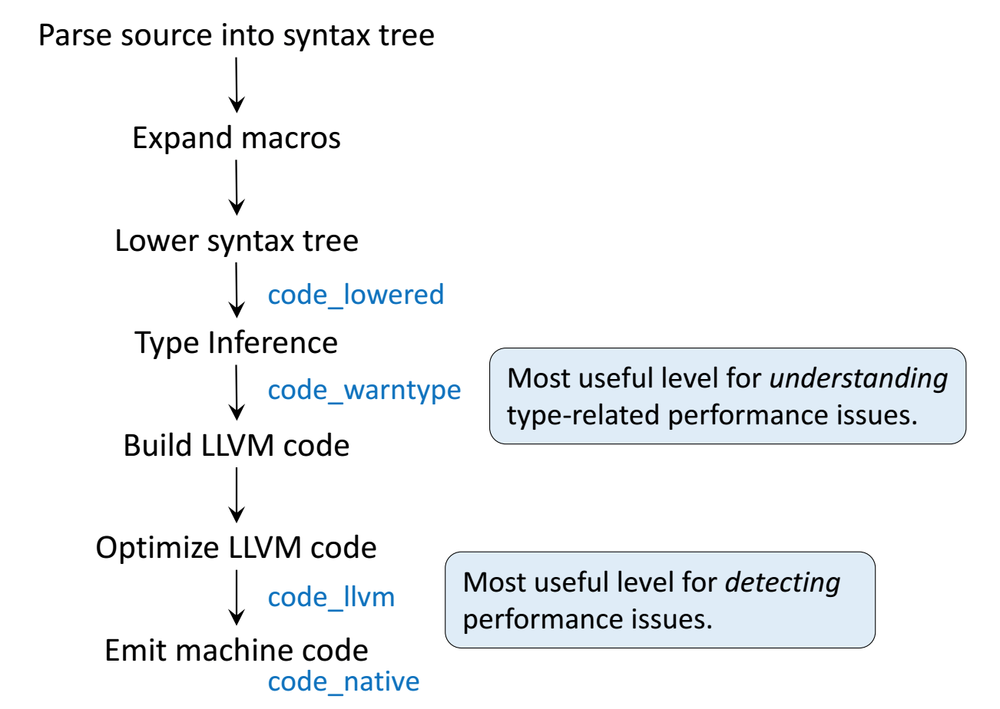

## Goals

1. Understand that programs are run in some context: file system, operating system, hardware, and so on.
2. Develop a mental model for programming.
3. Introduce basic syntax and its semantics: variables, literals, functions, and assignment.

## What is a programming language?

- A system of notation by which a programmer communicates a program to a computer.
- A program is a sequence of instructions that computes something; there are inputs and outputs.
- In contrast, a machine language is a formal system by which a computer understands and executes a program.
- The term *computer language* is a broader term that includes programming, machine, markup, and other languages used in computing.


## What is Julia?

{fig-align="center" fig-alt="Julia logo, which consists of the word 'julia' decorated with circles. Specifically, a green, red, and purple circle arranged in a triangle sit above the lower case letter `i`. A blue circle decorates the lower case letter `j`."}

> Julia is a high-level, high-performance dynamic programming language for technical computing, with syntax that is familiar to users of other technical computing environments.
>
> --- @bezanson2017


- The Julia programming language has been in development for over a decade (early work in 2009).
- Creators: [Jeff Bezanson](https://en.wikipedia.org/wiki/Jeff_Bezanson), [Alan Edelman](https://en.wikipedia.org/wiki/Alan_Edelman), [Stefan Karpinski](https://en.wikipedia.org/wiki/Stefan_Karpinski), [Viral Shah](https://en.wikipedia.org/wiki/Viral_B._Shah).
    - Two University of California alumni: Stefan and Viral.
- The 1.0 release took place in 2018.
- Current release: v1.11.7 (September 16, 2025); Array object is now implemented in Julia rather than C.

**Purpose**: Solve the so-called two language problem

- Prototype a solution to a problem in high-level language (R/Python/Mathlab).
- Fast, efficient production code goes into low-level language (Fortran/C/C++/Rust).
- Julia provides a high-level programming interface that can be used to generate fast, low-level machine code.
- Not just a “Fast R” or “Fast Matlab”!
    - Designed for technical computing from the start.
    - Design considerations all the way from the lowest level of abstraction up to the language syntax.
    - Part of the work in designing the language is [Jeff Bezanson’s PhD thesis](https://dspace.mit.edu/handle/1721.1/99811).


## Syntax and Semantics

The Julia runtime can only understand your instructions through the rules of the language. The language is composed of:

- **Syntax**: What you can say and how you represent ideas.
    + The syntax in a language defines rules. Break them and Julia will complain.
    + Might feel arbitrary... because it is!
    + These are deliberate design decisions that make trade-offs between competing requirements.
    + Tools built into integrated development environments (IDE) such as VSCode can often help catch these mistakes.
- **Semantics**: The intended meaning of symbols and rules.
    + Requires lots of exposure and practice to master.
    + Julia's syntax is quite clean at the surface level, but implications at the semantics level run deep.
    + IDE tools are less likely to catch semantic errors, which often surface as unexpected behavior or incorrect results when your code runs.

We will focus heavily on syntax in the beginning to learn how we can represent data and concepts within the language.


## Types of Programming Languages

- **Compiled languages** (low-level languages): C/C++, Fortran, ... 
  - Directly compiled to machine code that is executed by CPU 
  - Pros: fast, memory efficient
  - Cons: longer development time, hard to debug

- **Interpreted language** (high-level languages): R, Matlab, Python, SAS IML, JavaScript, ... 
  - Interpreted by interpreter
  - Pros: fast prototyping
  - Cons: excruciatingly slow for loops

- Mixed (dynamic) languages: Matlab (JIT), R (`compiler` package), Julia, Cython, Java, ...
  - Pros and cons: between the compiled and interpreted languages

- Script languages: Linux shell scripts, Perl, ...
  - Extremely useful for some data preprocessing and manipulation

- Database languages: SQL, Hive (Hadoop).  
  - Data analysis *never* happens if we do not know how to retrieve data from databases


## How do high-level languages work?

Typical execution of a high-level language such as R, Python, and Matlab.

{fig-align="center"}

1. Source code is compiled into *bytecode*, an intermediate representation of your program that is nearly 100% platform agnostic.
2. An interpreter executes your program directly. *No "native" machine code is required.*

To improve efficiency of interpreted languages such as R or Matlab, the conventional wisdom is to avoid loops as much as possible.
That is, **vectorize your code** as much as possible.
The only loop you are allowed to have is that for an iterative algorithm.
When looping is unavoidable, one resorts to C, C++, or Fortran. This creates the notorious **two language problem**.

- **Success Stories**: The popular `glmnet` package in R is coded in Fortran; `tidyverse` and `data.table` packages use a lot of RCpp/C++.

{fig-align="center" width="70%"}

Developers of high-level languages have made many efforts to bring their languages closer to the performance of low-level languages such as C, C++, or Fortran.

- Matlab has employed JIT (just-in-time compilation) technology since 2002.
- Since R 3.4.0 (Apr 2017), the JIT bytecode compiler is enabled by default at its level 3.
- Cython is a compiler system based on Python.


## What does Julia do different?

Modern languages such as Julia try to solve the two language problem: achieving efficiency without vectorizing code.

:::::::::::::::::::::::::::::::: layout-ncol="2"

Credit: Arch D. Robison

{fig-align="left" width="40%"}
{fig-align="right" width="59%"}

::::::::::::::::::::::::::::::::

- You, as a programmer, can only control the Julia source code.
- In writing good, efficient code your hope is to leverage the rules of the language to make the machine Do The Right Thing.
- Most interactive languages have *profiling* tools that allow you to inspect how much memory is used or how long different chunks of code take to run.
- Julia is a bit unusual in that it allows you to peek at how your source code is transformed at various levels all the way down to the machine level.


## Basic Julia Syntax

### Literals

**Literals** are the most basic symbols in a language to represent *different kinds* of data.

```{julia}
1 # Integer (abstract), specifically Int64 (concrete)
```

```{julia}
1. # or 1.0; Float64
```

```{julia}
1.f0 # Float32
```

```{julia}
π # Irrational
```

```{julia}
1 // 2 # Rational
```

```{julia}
'c' # Char
```

```{julia}
"Julia" # String
```

```{julia}
true # Bool
```

### Variables

Literals by themselves are not too useful unless we’re willing to write long expressions by hand.
**Variables** are symbols, not otherwise reserved by the language, that we can use to store meaning/value.

```{julia}
x = 1
```

```{julia}
# \pi + Tab
mypi = π
```

```{julia}
# \:smirk_cat: + Tab
😼 = sqrt(3)
```

```{julia}
x + mypi + 😼
```

The full list of special characters can be viewed at [https://docs.julialang.org/en/v1/manual/unicode-input/](https://docs.julialang.org/en/v1/manual/unicode-input/).

### Assignment

Creating variables requires **assignment** with `=`.
In Julia, you can bind a variable to

- a literal,
- another variable,
- a function, and
- anything else in the language.

You should think of **assignment** as *binding a specific value to a symbol*.


### Functions and Operators

If variables and literals are nouns in a programming language, then **functions** are the verbs.
There are many basic functions built-in to the language.
Many [fundamental mathematical operations](https://docs.julialang.org/en/v1.12/manual/mathematical-operations/) are part of the base language (arithmetic, `sum()`,` prod()`, `exp()`, `log()`, ...).

In Julia, **operators** are just functions that support special notation. For example, we can add numbers using *infix notation* and *prefix notation*.

```{julia}
+(1, 3) # prefix notation
```

```{julia}
1 + 3 # infix
```

```{julia}
+(1, 2, 3) # advantage of having functions define the operators
```


### Special Constructors

Virtually every type has a **constructor** to create an object from given inputs.
As a matter of convention:

- these functions always start with an uppercase letter, and
- have names aligned to the type they construct.

```{julia}
Rational(1, 2) # 1//2
```

```{julia}
UInt8(3) # 8-bit integer
```

```{julia}
@show String("1") # constructors
@show String(UInt8[0x68, 0x65, 0x6c, 0x6c, 0x6f, 0x2c, 0x20, 0x77, 0x6f, 0x72, 0x6c, 0x64, 0x21])
@show string(1); # similar, but treated differently conceptually
```


## Mental Models

**Credit**: Chris Rackauckas (A Deep Introduction to Julia for Data Science and Scientific Computing)

### Python/R/MATLAB: Talking to a Politician

- These languages were developed to "be easy".
- You tell them something, and they try to give you what you want.
- There may be some things hidden behind the scenes to make everything "work better".
- They may not give you the fastest reply.

### C/Fortran: Talking to a Philosopher

- You say something, and they want something more specific.
- You spend hours digging deep into the specifics of something.
- After finally getting it right, you know how to quickly get a specific answer from them.
- Every time you want to talk about something new, you have to start all the way at the basics again.

### Julia: Talking to a Scientist

- When you’re talking, everything looks general. However, you really mean very specific details determined by context.
- You can quickly dig deep into a subject, assuming many rules, theories, and terminology.
- Nothing is hidden: if you ever want to hear about every little detail, you can ask.
- They will get mad (and throw errors at you) if you begin to be loose with the specific details.
