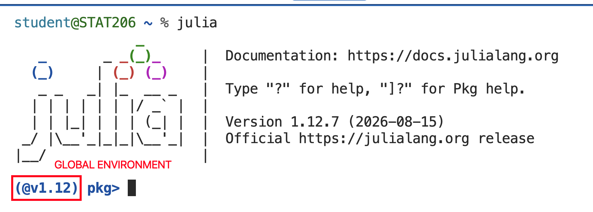
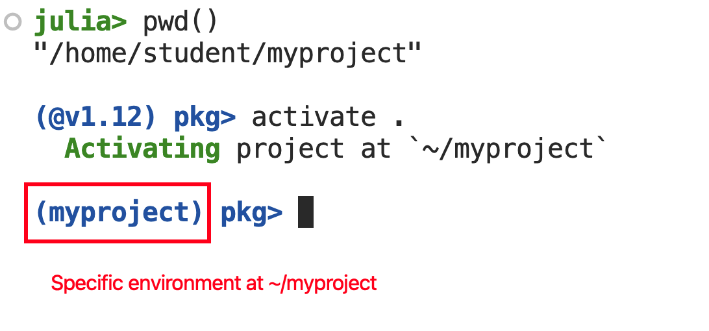
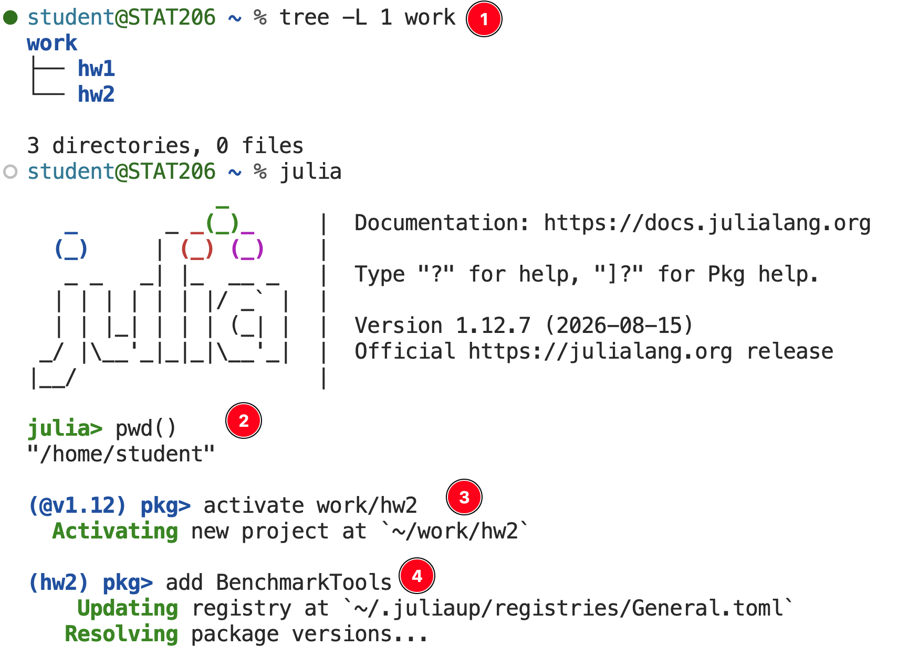
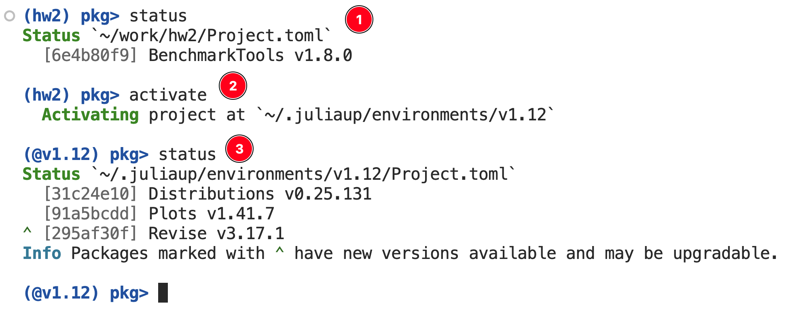

## Goals

1. Gain a basic understanding of package management systems.
2. Understand how to use Pkg to install dependencies from a project.
3. Understand how to use Pkg to specify dependencies on a project.


## Motivation

Software changes over time.
Often changes are positive: new features, faster execution, better performance.
Internally, a package's code base gradually accumulates *technical debt* as functions that were once composable become incompatible, data structures change or are replaced altogether, and interfaces evolve to meet development and user needs.

At a macro level, people write code that depends on different software packages.
We rarely ever use just the base Julia/Python/R language for data analytic jobs.
In practice, we search for an existing tool that matches the task at hand and patch in solutions in any gaps missed by the packages we use.
Thus, change within individual projects inevitably results in friction between projects used together.

### Example 1: R 4.0 release

From the [R-announce mailing list](https://stat.ethz.ch/pipermail/r-announce/2020/000653.html):

> R now uses a `stringsAsFactors = FALSE` default, and hence by
> default no longer converts strings to factors in calls to
> `data.frame()` and `read.table()`.

- Original behavior implicitly assumed any text data is basically a factor, which is not always the case and does not address categorical versus ordinal data.
- Users would work around this manually.
- New behavior broke any scripts or packages that assumed the widely used functions named above handled data in a specific manner.


### Example 2: Julia transition to 1.0

From [Julia HISTORY.md](https://github.com/JuliaLang/julia/blob/master/HISTORY.md#julia-v070-release-notes) and [JuliaLang repo](https://github.com/JuliaLang/julia/issues/11310):

> The syntax for parametric methods, `function f{T}(x::T)`, has been changed to function `f(x::T) where {T}`

- This was a breaking change introduced in v0.7 as Julia developers prepared for the official upcoming v1.0 release.
- Major change to language syntax. The old syntax led Julia users to write ambiguous function definitions and contributed to misunderstanding of an important language feature.
- Any package pre-v0.7 may contain this old syntax and may be incompatible with any modern Julia version.


## Package Management

In terms of reproducible research, we want a package manager that does the following:

- Keeps track of each package our project depends on; i.e. track **dependencies**.
- Keeps track of the **version** of each dependencies.
- Handles both *packages within the ecosystem* and *binaries* that we have zero control over.
- Detects incompatible versions.
- Can be used to quickly and reliably reconstruct part of the computing environment required for a project, be it a new library, an analysis pipeline, or a 


What do different languages use?

- R world: `renv` is among the most popular. `rv` is emerging as a contender. Can also use `conda` and its variants.
- Python world: `venv`, `conda`, `uv`, `poetry`... unfortunately there are lots of tools and there seems to be no consensus. You use whatever your team wants you to use.
- Julia world: `Pkg`. That's it. Julia developers had the benefit of learning from tools that came before.


## Pkg.jl

See the [Pkg documentation](https://pkgdocs.julialang.org/v1/) for full details.
You can use `Pkg` for complete programmatic control; for example, `Pkg.add("Package Name")`.

The main ideas to understand as you get started with `Pkg` are:

1. It treats a directory as an environment. Just `] activate ...` an environment to start using specific packages and versions tied to it.
2. It uses a `Project.toml` file that enumerates *which* packages are required, and optionally restricts version numbers. Use the `] add ...` and `] rm ...` commands to edit this through the REPL.
3. A separate `Manifest.toml` handles all the specific version numbers and additional required packages. You don't need to touch this.
4. Any time you need to share your work, you include the `Project.toml` file. You collaborator just runs `] instantiate` to download everything that is required.


### `Project.toml`

```{text}
[deps]
CSV = "336ed68f-0bac-5ca0-87d4-7b16caf5d00b"
DataFrames = "a93c6f00-e57d-5684-b7b6-d8193f3e46c0"
Plots = "91a5bcdd-55d7-5caf-9e0b-520d859cae80"
StatsPlots = "f3b207a7-027a-5e70-b257-86293d7955fd"
```

- Always put under version control in a project!
- Can partially edit by hand e.g. to specify working versions.


### `Manifest.`toml

```{text}
# This file is machine-generated - editing it directly is not advised

julia_version = "1.12.7"
manifest_format = "2.0"
project_hash = "e98c3398a988320f50061e3624326fe2cdb04207"

[[deps.AbstractFFTs]]
deps = ["LinearAlgebra"]
git-tree-sha1 = "d92ad398961a3ed262d8bf04a1a2b8340f915fef"
uuid = "621f4979-c628-5d54-868e-fcf4e3e8185c"
version = "1.5.0"
weakdeps = ["ChainRulesCore", "Test"]

    [deps.AbstractFFTs.extensions]
    AbstractFFTsChainRulesCoreExt = "ChainRulesCore"
    AbstractFFTsTestExt = "Test"

[[deps.AbstractTrees]]
git-tree-sha1 = "2d9c9a55f9c93e8887ad391fbae72f8ef55e1177"
uuid = "1520ce14-60c1-5f80-bbc7-55ef81b5835c"
version = "0.4.5"

# ----- truncated because these are REALLY long -----
```

- Usually excluded from version control unless you need exact reproducibility on the same hardware.
- NEVER edit by hand.


### Using the Julia REPL to handle dependencies

In a Julia REPL, type <kbd>]</kbd> to enter package mode. Exit with <kbd>Backspace</kbd> or <kbd>Delete</kbd>.

- `] help`: Ask about the available commands. Can also clarify a command; e.g. `] add help`.
- `] add NAME`: add a package; can specify version number of commit hash.
- `] rm NAME:`: remove a package.
- `] instantiate`: reproduce from a Project.toml file.
- `] update`: update all or a specific package

## Demo

{fig-align="center" width=80%}

- Enter package mode. Default is the global `@v1.12` environment (depending on your Julia version).

{fig-align="center" width=50%}

- Check where we are, then `] activate .` *this* directory as a Julia environment.
- The package mode prompt changes to reflect the active environment.

{fig-align="center" width=70%}

1. Check the file structure from *here*.
2. Start a Julia REPL, and check where *here* is just to make sure.
3. Activate the environment as `~/work/hw2`.
4. Add a required package for that assignment.

{fig-align="center" width=73%}

1. Verify the installed packages for the currently active environment.
2. Go back to the global environment with `] activate` (no extra arguments).
3. Verify that we're working off `@v1.12` as promised.
