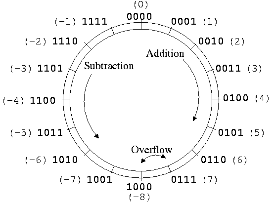
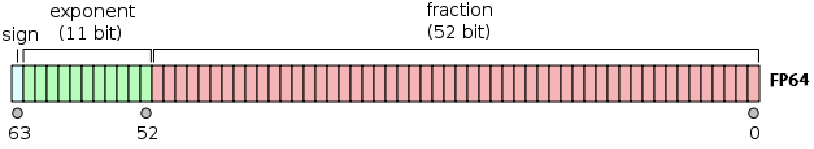
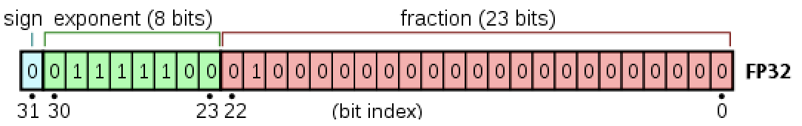
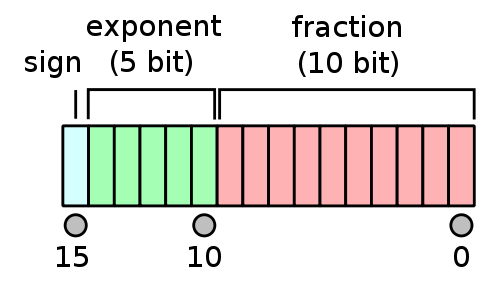
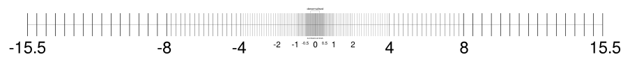
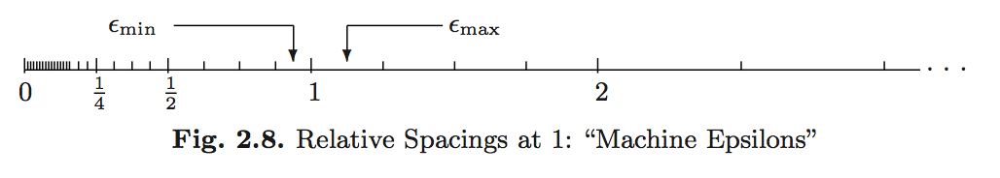

## Goals

1. Develop an understanding of how numbers are represented on a computer.
2. Gain an awareness of the failure modes of computer number systems.

## Integers: Fixed-Point System

- Fixed-point number system is a computer model for integers $\mathbb{Z}$.
- The number of bits and method of representing negative numbers vary from system to system.
    - The `integer` type in R has 32 or 64 bits, determined by machine word size.
    - Matlab has `(u)int8`, `(u)int16`, `(u)int32`, `(u)int64`.
- Julia has even more integer types:
    - Storage for a `Signed` or `Unsigned` integer can be $M = 8, 16, 32, 64$ or $128$ bits.

### Signed Integers

- First bit indicates sign.
    - `0` for nonnegative numbers
    - `1` for negative numbers
- **Two's complement representation** for negative numbers.
    - Sign bit is set to `1`.
    - Remaining bits are set to opposite values
    - `1` is added to the result
    - Two's complement representation of a negative integer `x` is same as the unsigned integer `2^64 + x`.

```{julia}
@show typeof(18)
@show bitstring(18)
@show bitstring(-18) # two's complement representation
@show bitstring(UInt64(Int128(2)^64 - 18)) == bitstring(-18) # modular arithmetic
@show bitstring(2 * 18) # shift bits of 18
@show bitstring(2 * -18); # shift bits of -18
```

Two's complement representation respects modular arithmetic. Adding any two signed integers is just bitwise addition, possibly module $2^{M}$.

{fig-align="center" width=40%}

Arithmetic (addition, substraction, multiplication) on integers is exact except for the possiblity of overflow and underflow.

The **range** of representable integers by an $M$-bit **signed integer** is $[-2^{M-1}, 2^{M-1}-1]$.

- `typemin(T)` and `typemax(T)` give the smallest and largest representable number using type `T`.

```{julia}
typemin(Int64), typemax(Int64)
```

```{julia}
for T in [Int8, Int16, Int32, Int64, Int128]
  println(T, '\t', typemin(T), '\t', typemax(T))
end
```

### Unsigned Integers

**Unsigned integers** use all $M$ bits to represent non-negative integers. Their range is $[0, 2^{M}-1]$.

```{julia}
for t in [UInt8, UInt16, UInt32, UInt64, UInt128]
  println(t, '\t', typemin(t), '\t', typemax(t))
end
```

### `BigInt`

The `BigInt` type is used to represent arbitrarily large integers.

```{julia}
@show typemax(Int128)
@show typemax(Int128) + 1 # modular arithmetic!
@show BigInt(typemax(Int128)) + 1;
```

### Overflow Behavior

What happens when an arithmetic operation results in a value outside the representable range?
This is known as **overflow behavior** and it varies across programming languages.

In R, overflow behavior is to emit `NA`:

```{r}
#| eval: false
.Machine$integer.max
```

```{r}
#| eval: false
M <- 32
big <- 2^(M - 1) - 1
as.integer(big)
```

```{r}
#| eval: false
as.integer(big + 1)
```

Julia integers will instead "wrap around" based on modular arithmetic.

```{julia}
@show typemax(Int32)
@show typemax(Int32) + Int32(1); # modular arithmetic!
```

## Real Numbers: Floating-Point System

The floating-point number system is a computer model for real numbers $\mathbb{R}$.

- Most computer systems adopt the [IEEE 754](https://en.wikipedia.org/wiki/IEEE_754) standard, established in 1985, for floating-point arithmetics.
    - For the history, see an interview with [William Kahan](https://people.eecs.berkeley.edu/~wkahan/ieee754status/754story.html).
    - His [personal website](https://people.eecs.berkeley.edu/~wkahan/MxMulEps.pdf) records his advocacy for better computing and education about computing throughout time.
- In the scientific notation, a real number is represented as 

    $$
    \pm d_{0} . d_{1} d_{2} \cdots d_{p} \times b^{e}.
    $$

    On a computer, the **base** is $b = 2$ and the digits $d_{i}$ are one of $0$ or $1$.

- A **normalized** floating-point number has $d_{0} \neq 0$. For example, $+1.0010 \times 2^{4}$.
- A **denormalized** numbers has $d_{0} = 0$. For example, $0.1001 \times 2^{5}$ (equivalent).
- Under this system, a computer must keep track of
    - The *sign bit*.
    - The *fraction* (or mantissa, significand) of the *normalized* representation.
    - The actual *exponent* $e$ plus a *bias*.

As with integers, there are several floating point types.

### Double Precision `Float64`

{fig-align="center" width=70%}

Double precision (64 bits = 8 bytes) numbers are the dominant data type in **scientific computing**.

- Bit on the left is the sign bit.
- $p = 52$ significant bits.
- 11 bits for the exponent $e$. This means $e_{\mathrm{min}} = -1022$ and $e_{\mathrm{max}} = 1023$. The **bias** is $1023$.
- Note that $e_{\mathrm{min}} - 1$ and $e_{\mathrm{max}} + 1$ are reserved for special numbers.
- Range for magnitude: $10^{\pm 308}$ in *decimal notation* because $\log_{10}(2^{1023}) \approx 308$.
- Double precision numbers are precise up to about the $-\log_{10}(2^{-52}) \approx 15$ decimal point.

```{julia}
println("Double precision:")
@show bitstring(Float64(18))    # 18 in double precision
@show bitstring(Float64(-18));  # -18 in double precision
```

### Single Precision `Float32`

{fig-align="center" width=60%}

- $p = 23$ significant bits.
- $8$ exponent bits: $e_{\mathrm{min}} = -126$ and $e_{\mathrm{max}} = 127$. Bias is 127.
- Also reserves numbers at the extreme ends.
- Range for magnitude: $10^{\pm 38}$ in *decimal notation* because $\log_{10}(2^{127}) \approx 38$.
- Precise up to about the $-\log_{10}(2^{-23}) \approx 7$ decimal point.

```{julia}
println("Single precision:")
@show bitstring(Float32(18.0))    # 18 in single precision
@show bitstring(Float32(-18.0));  # -18 in single precision
```

### Half-Precision `Float16`

{fig-align="center" width=20%}

- $p = 10$ significant bits.
- $5$ exponent bits: $e_{\mathrm{min}} = -14$ and $e_{\mathrm{max}} = 15$. Bias is 15.
- Also reserves numbers at the extreme ends.
- Range for magnitude: $10^{\pm 4}$ in *decimal notation* because $\log_{10}(2^{15}) \approx 4$.
- Precise up to about the $-\log_{10}(2^{-10}) \approx 3$ decimal point.

```{julia}
println("Single precision:")
@show bitstring(Float16(18.0))    # 18 in single precision
@show bitstring(Float16(-18.0));  # -18 in single precision
```

### Special Floating-Point Numbers

#### Infinity: `+Inf` and `-Inf`

Exponent $e_{\mathrm{max}} + 1$ (exponent bits all 1) with a zero mantissa means $\pm \infty$

```{julia}
@show bitstring(Inf)    # Inf in double precision
@show bitstring(-Inf);  # -Inf in double precision
```

#### Not a Number: `NaN`

Exponent $e_{\mathrm{max}} + 1$ (exponent bits all 1) with a nonzero mantissa means `NaN`. `NaN` could be produced from `0 / 0`, `0 * Inf`, $\ldots$

```{julia}
@show bitstring(0 / 0)    # NaN
@show bitstring(0 * Inf); # NaN
```

- Note that `NaN` $\neq$ `NaN`.
- In fact, `x == NaN` is always `false`.
- Use `isnan()` to check for "not a number".

#### Zero `0`

Exponent $e_{\mathrm{min}} - 1$ (exponent bits all 1) with a zero mantissa represents the real numbrer $0$.

```{julia}
@show bitstring(0.0)    # +0 in double precision 
@show bitstring(-0.0);  # -0 in double precision
```

There are some special rules in IEEE 754 for [signed zeros](https://en.wikipedia.org/wiki/Signed_zero).
Exponent $e_{\mathrm{min}} - 1$ (exponent bits all 1) with a nonzero mantissa represents numbers less than $b^{e_{\mathrm{min}}}$. Thus, numbers are *denormalized* in the range $(0, b^{e_{\mathrm{min}}})$. This is **graceful underflow**.

```{julia}
@show nextfloat(0.0) # next representable number
@show bitstring(nextfloat(0.0)); # denormalized
```

### Rounding

Rounding is necessary whenever a number has more than $p$ significand bits. Most computer systems use the default IEEE 754 **round to nearest** mode (also called **ties to even** mode). Julia offers several [rounding modes](https://docs.julialang.org/en/v1/base/math/#Base.Rounding.RoundingMode), the default being [`RoundNearest`](https://docs.julialang.org/en/v1/base/math/#Base.Rounding.RoundNearest). For example, the number 0.1 in decimal system cannot be represented accurately as a floating point number:
$$
0.1 = 1.\underbrace{1001}_\text{repeat}\underbrace{1001}... \times 2^{-4}
$$

```{julia}
# half precision Float16, ...110(011...) rounds down to 110
@show bitstring(Float16(0.1))
# single precision Float32, ...100(110...) rounds up to 101
@show bitstring(0.1f0) 
# double precision Float64, ...001(100..) rounds up to 010
@show bitstring(0.1);
```

For a number with mantissa ending with ...001(100..., all 0 digits after), it's a tie and will be rounded to ...010 to make the mantissa even.


### Overflow and Underflow Behavior

For double precision, the range is $\pm 10^{\pm 308}$. In most situations, underflow (magnitude of result $<$ $10^{-308}$) is preferred over overflow (magnitude of result $>$ $10^{308}$) because the latter produces $\pm \infty$. On the other hand, underflow yields zeros or denormalized numbers.

- `floatmin` and `floatmax` functions gives largest and smallest _finite_ number represented by a type.

#### Example: Logit link

The logit link function is

$$
p(x) = \frac{\exp (x^T \beta)}{1 + \exp (x^T \beta)} = \frac{1}{1+\exp(- x^T \beta)}.
$$

It is commonly used in *logistic regression*, *binary classification*, and is generalized by the [softmax function](https://en.wikipedia.org/wiki/Softmax_function) (ubiquitous in machine learning).
The former expression can easily lead to `Inf / Inf = NaN`, while the latter expression leads to graceful underflow.


### Summary

- Julia provides `Float16` (half precision), `Float32` (single precision), `Float64` (double precision), and `BigFloat` (arbitrary precision).
- **Double precision**: range $\pm 10^{\pm 308}$ with precision up to 16 decimal digits.  
- **Single precision**: range $\pm 10^{\pm 38}$ with precision up to 7 decimal digits.
- **Half precision**: range $\pm 10^{\pm 4}$ with precision up to 3 decimal digits.
- The floating-point numbers do not occur uniformly over the real number line. Each magnitude has the same number of representable numbers, except those around 0 (thanks to graceful underflow).

{fig-align="center" width=50%}

- **Machine epsilons** are the spacings of numbers around 1 (depending on floating-point precision):
    $$
    \epsilon_{\min}=b^{-p}, \quad  \epsilon_{\max} = b^{1-p}.
    $$

{fig-align="center" width=50%}

```{julia}
@show eps(Float32)  # machine epsilon for a floating point type
@show eps(Float64)  # same as eps()
# eps(x) is the spacing after x
@show eps(100.0)
@show eps(0.0) # grace underflow
# nextfloat(x) and prevfloat(x) give the neighbors of x
@show x = 1.25f0
@show prevfloat(x), x, nextfloat(x)
@show bitstring(prevfloat(x))
@show bitstring(x)
@show bitstring(nextfloat(x));
```


## Arbitrary Precision

The `BigFloat` type provides arbitrary precision in Julia. It is *significantly* slower than the finite precision types, and should be used only when you've exhausted all mathematical and computational tricks.

```{julia}
@show precision(BigFloat) # default precision (how many bits) of BigFloat
@show floatmin(BigFloat)
@show floatmax(BigFloat);
```


## Catastrophic Cancellation

### Scenario 1

Addition or subtraction of two numbers of widely different magnitudes: $a+b$ or $a-b$ where $a \gg b$ or $a \ll b$. We lose the precision in the number of smaller magnitude. Consider 

$$
\begin{eqnarray*}
    a &=& x.xxx ... \times 2^{30} \\  
    b &=& y.yyy... \times 2^{-30}
\end{eqnarray*}
$$

What happens when computer calculates $a+b$? We get $a+b=a$!

```{julia}
@show a = 2.0^30
@show b = 2.0^-30
@show a + b == a;
```

### Scenario 2

Subtraction of two nearly equal numbers eliminates significant digits. $a-b$ where $a \approx b$. Consider 

$$
\begin{eqnarray*}
    a &=& x.xxxxxxxxxx1ssss  \\
    b &=& x.xxxxxxxxxx0tttt
\end{eqnarray*}
$$

The result is $1.vvvvu...u$ where $u$ are unassigned digits.

```{julia}
a = 1.2345678f0 # rounding
@show bitstring(a) # rounding
b = 1.2345677f0
@show bitstring(b)
# correct result should be 1e-7
# we see a large error due to catastrophic cancellation
@show a - b;
```

## Implications for Computing

- **Rule 1**: Add small numbers together before adding larger ones.
- **Rule 2**: Add numbers of like magnitude together (paring). When all numbers are of same sign and similar magnitude, add in pairs so at each stage the summands are of similar magnitude.
- **Rule 3**: Avoid subtraction of two numbers that are nearly equal.
